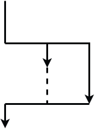
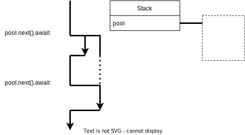

class: center
name: title
count: false

# LSRTM 2022-05

.p60[]

.left[.citation[View slides at `https://nikomatsakis.github.io/lsrtm-2022-05/`]]

---

# JavaScript promises

```js
async function process() {
    let promise = sendRequest();
    let result = await promise;
}

async function sendRequest() { /* ... */ }
```


???

---

# Rust futures

```rust
async fn process() {
    let future = sendRequest();
    let result = future.await;
}

async fn sendRequest() -> Result { /* ... */ }
```


---

# Rust futures 1

```rust
async fn process() {
    let future = sendRequest();
    let result = future.await;
}

async fn sendRequest() -> Result { /* ...1 */ }
```

.line2[]


---

# Rust futures 2

```rust
async fn process() {
    let future = sendRequest();
    let result = future.await;
}

async fn sendRequest() -> Result { /* ...2 */ }
```

.line3[]


---

name: combinators

# Rust future combinators

```rust
async fn process() {
    let future1 = sendRequest();
    let future2 = sendRequest();
    let future3 = futures::future::join(future1, future2);
    let (result1, result2) = future3.await;
}

async fn sendRequest() -> Result { /* ... */ }
```

---

template: combinators



---

template: combinators

.line2[]


---

template: combinators

.line3[]


---

template: combinators

.line4[]


---

template: combinators

.line5[]


---

# Polling (simplified)

```rust
trait Future {
    type Output;

    fn poll(&mut self) -> Ready<Self::Output>;
}

enum Poll<T> {
    Ready(T),
    Pending,
}
```

---

# Awaiting

```rust
let result = future.await;

// becomes

let result = loop {
    match future.poll() {
        // If the value is available,
        // break from loop and use 
        // `v` as the value of the loop.
        Poll::Ready(v) => break v,

        // Otherwise, suspend current
        // task. Will be reawoken when
        // data might be ready.
        Poll::Pending => yield,
    }
};
```

---

# Join combinator

```rust
struct Join<F1, F2>
where
    F1: Future,
    F2: Future<Output = F1::Output>,
{
    future1: Option<F1>,
    future2: Option<F2>,
    output1: Option<F1::Output>
    output2: Option<F1::Output>
}
```

Poll method:

* Polls `self.f1` and polls `self.f2` until both have returned.
* If one returns before the other, stash the output until both have returned.

---

name: f-u

# `FuturesUnordered`

```rust
let mut pool = FuturesUnordered::new();
pool.push(sendRequest());
pool.push(sendRequest());
let first = pool.next().await;  // yields Some(r) 
let second = pool.next().await; // yields Some(r)
let none = pool.next().await;   // none
```

---

template: f-u


---

template: f-u

.line1[]


---

template: f-u

.line2[]


---

template: f-u

.line3[]


---

template: f-u

.line4[]


---

template: f-u

.line5[]



---

template: f-u

.line6[]


---

# Review

* A Rust future is inert unless you are awaiting it

--


* Rust futures introduce *concurrency* within a task (by default)
    * You can use `tokio::spawn` to start a new task


--


* `FuturesUnordered` feels like a thread-pool but is not
    * The futures pushed inside only make progress when awaited


---

# Snippet

[Playground link](https://play.rust-lang.org/?version=stable&mode=debug&edition=2021&gist=66455d3e61217d86ec4839c926619bf0)

---

# Brief plug: moro

I have been experimenting with a "structured concurrency" library called [moro](https://github.com/nikomatsakis/moro/).


